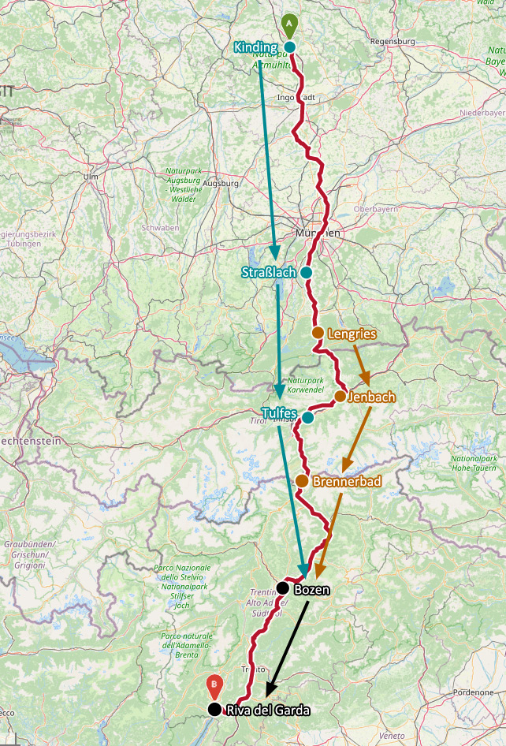

# Alpen-Cross 2021

## Übersicht

## Donnerstag, 22. Juli

####  Team

Kinding - Straßlach

### Anreise

| Abfahrt | Ankunft |
| ------- | ------- |
| Erlangen, **08:29**, Gleis 4 | Nürnberg Hbf, 08:48, Gleis 14 |
| Nürnberg Hbf, 09:08, Gleis 12 | Kinding, **09:36**, Gleis 4 |

### Route

[Tag 1, 137 km, 643 Hm - BRouter](http://brouter.de/brouter-web/#map=9/48.4895/12.5491/osm-mapnik-german_style&lonlats=11.375967,48.993101;11.414881,48.821897;11.427026,48.806382;11.50805,48.536187;11.576929,48.351373;11.642933,48.244204;11.625091,48.194086;11.609631,48.163765;11.595876,48.146629;11.588119,48.132541;11.559774,48.107402;11.551523,48.090752;11.514208,48.004855&profile=fastbike-lowtraffic)

### Übernachtung

- Verantwortlich: Torsten
- für Björn, Jan, Torsten, Michi, Eni, Sören, Holger

####  Team

Lengries - Jenbach

### Übernachtung

- Verantwortlich: Steppi
- [Jenbacher Hof](https://www.jenbacherhof.at/de/Home)
- Postgasse 22, 6200 Jenbach, Österreich

## Freitag, 23. Juli

####  Team

Straßlach - Lans

### Route

[Tag 2, 124 km, 1071 Hm - BRouter](http://brouter.de/brouter-web/#map=9/47.5081/12.0575/osm-mapnik-german_style&lonlats=11.514015,48.004395;11.706448,47.532197;11.705589,47.506853;11.714516,47.460519;11.744084,47.374262;11.577916,47.301541;11.433635,47.238453&profile=fastbike-lowtraffic)

### Übernachtung

- für Björn, Jan, Torsten, Michi, Eni, Sören, Holger

####  Team

Jenbach - Brennerbad

### Übernachtung

- Verantwortlich: Steppi
- [Gashof Silbergasser](https://silbergasser.it/)
- Brennerbad 5, 39041 Brenner, Italien

## Samstag, 24. Juli

Lans / Brennerbad - Leifers

### Route

[Tag 3, 132 km, 1090 Hm - BRouter](http://brouter.de/brouter-web/#map=13/47.2002/11.4266/osm-mapnik-german_style&lonlats=11.432798,47.238496;11.450307,46.950892;11.444664,46.937649;11.640369,46.686962;11.623503,46.680912;11.578496,46.644722;11.569462,46.642104;11.567037,46.641021;11.566029,46.638771;11.551716,46.63052;11.5238,46.582742;11.490004,46.526066;11.451895,46.499602;11.400992,46.492823;11.384314,46.494611;11.344296,46.439417;11.333449,46.423615&profile=fastbike-lowtraffic)

### Übernachtung

- für Regine, Steppi, Björn, Jan, Torsten, Michi, Eni, Sören, Holger

## Sonntag, 25. Juli

Leifers - Riva del Garda

### Route

[Tag 4, 103 km, 246 Hm - BRouter](http://brouter.de/brouter-web/#map=10/46.1675/10.9245/osm-mapnik-german_style&lonlats=11.333427,46.423689;11.314802,46.412092;11.208125,46.245104;11.152174,46.224638;11.136703,46.202644;11.114666,46.183708;11.101727,46.15968;11.075678,46.142768;11.078382,46.132988;11.086535,46.129232;11.086085,46.116354;11.111362,46.051283;11.122327,46.012299;11.122842,46.001964;11.103959,45.950299;11.051774,45.921586;11.016326,45.890306;11.008666,45.866853;10.994364,45.851873;10.842025,45.886483&profile=fastbike-lowtraffic)

### Übernachtung

- für Regine, Steppi, Björn, Jan, Torsten, Michi, Eni, Sören, Holger

## Montag, 26. Juli

- Rückreise von Torsten, Eni, Sören, Jan

## Dienstag, 27. Juli

- Rückreise von Regine, Steppi, Björn, Holger
- 37,90 € (Super Sparpreis EU)
- 12,00 € (Fahrradkarte International)

| Abfahrt | Ankunft |
| ------- | ------- |
| Rovereto, **13:43**, Gleis ? | München, 18:27, Gleis ? |
| München, 18:53, Gleis ? | Erlangen, **20:17**, Gleis 1 |

## Streckenzusammenfassung

####  Team

| Tag | Strecke | Entfernung | Höhenmeter |
| --- | ------- | ---------- | ---------- |
| 1 | Kinding - Straßlach      | 137 | 643  |
| 2 | Straßlach - Lans         | 124 | 1071 |
| 3 | Lans - Leifers           | 132 | 1090 |
| 4 | Leifers - Riva del Garda | 101 | 246  |
|   |                       | **494** | **3050** |
