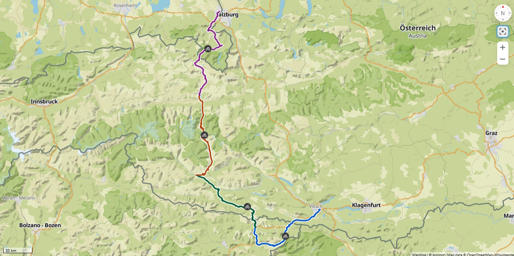

# Alpen-Cross 2024

20.06.2024 - 24.06.2024

## Übersicht

## Donnerstag 20.06.2024

Freilassing - **Hirschbichl (1183 m)** - Zeller See

### Anreise

| Abfahrt | Ankunft |
| ------- | ------- |
| Erfurt, **06:31**, Gleis 1 | |
| Erlangen, **07:53**, Gleis 4 | |
| Nürnberg, **08:12**, Gleis 8 | München Hbf, 9:17 |
| München Hbf, 09:55 | Freilassing, **11:33**, Gleis 2 |

### Route

[Tag 1, 97 km, 1435 Hm](http://brouter.de/brouter-web/#map=14/47.3976/12.8514/osm-mapnik-german_style&lonlats=12.977192,47.836234;12.901812,47.753218;12.879581,47.729771;12.874904,47.723736;12.874593,47.718128;12.89796,47.720127;12.901329,47.719275;13.001171,47.629899;12.770834,47.50594;12.847738,47.427114;12.853832,47.397649;12.815552,47.315436)

### Übernachtung
* [Hotel Traube](https://hotel-traube.name)
* Seegasse 4, Zell am See
* Verantwortlich: Sören
* 2 DZ, 1 EZ

## Freitag 21.06.2024

Zeller See - **Großglockner-Hochalpenstraße (2504 m)** - **Iselsbergpass (1204 m)** - Lienz

### Route

[Tag 2, 92 km, 2390 Hm](http://brouter.de/brouter-web/#map=9/47.0675/12.7414/osm-mapnik-german_style&lonlats=12.816195,47.32635;12.768259,46.829605&profile=fastbike)

### Übernachtung
* [Hotel Sonne Lienz](https://www.booking.com/hotel/at/best-western-sonne.de.html)
* Südtiroler Platz 8, 9900 Lienz
* Verantwortlich: Torsten
* 2 DZ, 1 EZ
* Ü/F

## Samstag 22.06.2024

Lienz - **Gailbergsattel (982 m)** - **Nassfeldpass (1530 m)** - Pontebbba

### Route

[Tag 3, 84 km, 1390 Hm](https://www.google.com/maps/place/B%26B+Ta+Famee/@46.507977,13.308466,17z/data=!3m1!4b1!4m9!3m8!1s0x477a11dc6a673001:0x7c449c3b1c3f0a05!5m2!4m1!1i2!8m2!3d46.507977!4d13.308466!16s%2Fg%2F11g__mlsm?entry=ttu)  

### Übernachtung
* [B&B Ta Famee](https://www.booking.com/hotel/it/albergo-roma-tolmezzo.de.html)
* Via della Chiesa, 22, 33016 Pontebba UD, Italien.  +39 340 562 1350
* Verantwortlich: Jürgen
* 3 Zimmer, 2 Bäder
* Ü/F

## Sonntag 23.06.2024

Pontebbba - Villach

### Übernachtung
* [Seepension Smoley](https://www.smoley.at)
* Peter-Melcher-Straße 15, 9524 St. Magdalen
* Verantwortlich: Eni

### Route

[Tag 4, 93 km, 1260 Hm](https://www.komoot.com/de-de/tour/1629802362?share_token=arGNfXpIgzfSQtMRcjkbr39ykAuyYBnFZOXR82hmv4NzgA4ULj&ref=)

## Montag 24.06.2024

Es gibt in der Gegend viele Seen und man müsste ggf. vom See noch nach Villach oder einem anderen der vielen Haltepunkte des Zuges fahren.

### Route

### Rückreise

| Abfahrt | Ankunft |
| ------- | ------- |
| Klagenfurth, **10:42**, Gleis 3 
| Villach **11:16**, Gleis 4 | München, 15:41, Gleis ? |
| München, 16:55, Gleis ? | Nürnberg, **18:04**, Gleis 6 |
| | Erlangen, **18:18**, Gleis 1 |
| | Erfurt, **19:26** |

## Streckenzusammenfassung

| Tag | Strecke                  | Entfernung | Höhenmeter |
| --- | ------------------------ | ---------- | ---------- |
| 1   | Freilassing - Zeller See | 97         | 1435       |
| 2   | Zeller See - Lienz       | 92         | 2390       |
| 3   | Lienz - Pontebbba        | 84         | 1390       |
| 4   | Pontebbba - Villach      | 93         | 1260       |
|     |                          | **366**    | **6475**   |
