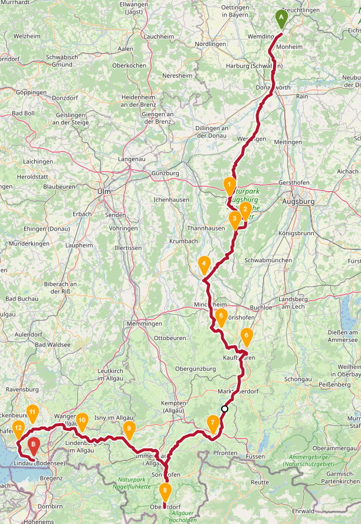

# Brauereitour 2021

Donauwörth - Wertingen - Mindelheim - Kaufbeuren - Marktoberdorf - Sonthofen - Oberstdorf - Immenstadt i. Allgäu - Lindau

## Mittwoch, 1. September

### Anreise

Die Anreise mit dem Zug bis Otting-Weilheim kostet 40,60 € (2x Tages Ticket Plus).

| Abfahrt | Ankunft |
| ------- | ------- |
| Erlangen, **16:13**, Gleis 3 | Nürnberg, 16:33, Gleis 9 |
| Nürnberg, 16:39, Gleis 5 | Otting-Weilheim, **17:43**, Gleis 3 |

### Brauereien

| Brauerei | Quelle | Öffnungszeiten | Bemerkung |
| -------- | ------ | -------------- | --------- |
| Schwanenbräu | Gasthof zum Schwanen, Hauptstraße 8, 86637 Wertingen | 17:00 – 22:00 (außer Do) | |
| Stark | [Landgasthof Stark](https://landgasthof-stark.de/), Alte Straße 4, 86637 Gottmannshofen | 17:00 - 22:00 (Mi - Sa) | |

### Übernachtung

### Route

[Route - Tag 1, 46 km, 290 Hm](https://bit.ly/3q6o455)

## Donnerstag, 2. September

### Brauereien

| Brauerei | Quelle | Öffnungszeiten | Bemerkung |
| -------- | ------ | -------------- | --------- |
| Schwarzbräu | [Schwarzbräustübl](https://www.schwarzbraeu.de/de/br%C3%A4ust%C3%BCberl), Marktplatz 6, 86441 Zusmarshausen | 11:30 - 14:00  | |
| Usterbacher | [Bräustüble](http://www.ustersbacher-braeustueble.com/), Hauptstraße 40, 86514 Ustersbach | ab 10:00 | |
| Staudenbräu | [Staudenbräu](https://staudenbraeu.de/), Grimoldsrieder Str. 2, 86877 Walkertshofen | 09:00 – 17:00 (Mo – Fr) | Biergarten/Wirtsstube nach persönlicher Vereinbarung geöffnet |
| Storchenbräu | [Bräustüble Pfaffenhausen](http://www.storchenbraeu.de/braeustueble-pfaffenhausen-wieder-geoeffnet/), Kirchpl. 5, 87772 Pfaffenhausen | 10:00 - 14:00, 16:30 – 22:00 (Do - So) | |
| Häpfenbräu | [Braustadl Häpfenbräu](http://www.braustadel-rammingen.de/), Am Bahnhof 4, 86871 Rammingen | 17.00 - 23.00 (Mi - Fr) | |
| Lindenbrauerei | [Gasthaus Drei König](https://lindenbrauerei.net/drei-koenig/), Memminger Str. 1, 87719 Mindelheim | ab 17:00 | |
| Hirschbräu | Hirschbräu, Mühlbachstraße 14, 87742 Dirlewang | | eventuell Supermarkt Mindelheim |

### Route

[Route - Tag 2, 92 km, 788 Hm](https://bit.ly/3dUdvPq)

### Übernachtung

## Freitag, 3. September

### Brauereien

| Brauerei | Quelle | Öffnungszeiten | Bemerkung |
| -------- | ------ | -------------- | --------- |
| Irseer Klosterbräu | [Irseer Braugasthof](https://irsee.com/), Klosterring 1-3, 87660 Irsee/Allgäu | 10.00 - 23.00 | |
| ~~Aktienbrauerei Kaufbeuren~~ | | | Großbrauerei |
| [Dein Bier](https://www.deinbier-allgäu.de/verkauf) | [Mein Buffet](http://www.mein-buffet.com/), Bahnhofstr. 1, 87665 Mauerstetten | 06:00 - 18:00 | oder [Reisach Früchtegarten](https://www.reisach-fruechtegarten.de/), Alpenweg 16, Mauerstetten |
| Apfeltranger Bier | [Landgasthof Hubertus](https://www.hubertus-apfeltrang.de/restaurant/), Wenglinger Str. 2, 87674 Apfeltrang | ganztägig, Küche 11:30 - 13:30 | |
| Kirnachtaler Bier | [Kirnachstuben](https://www.kirnachstuben.de/brauerei/), Hauptstr. 38, 87674 Ruderatshofen | ? (derzeit abweichend) | |
| ~~Allgäuer Brauhaus~~ | | | Großbrauerei |
| Berghof Babel | [Bräustüberl](https://www.berghof-babel.de/restaurant/braeustueberl.html), Nesselwanger Str. 44, 87616 Wald im Ostallgäu | 11:30 - 23:00 (Fr), 09:00 - 18:00 (Sa) | |
| [Braumanufactur Allgäu](https://brau-manufactur-allgaeu.de/) | Hauptstr. 25, 87484 Nesselwang | | evtl. Getränkemarkt |
| [BernardiBräu](https://www.bernardibraeu.de/fachgeschaumlfte.html) | [Kranzegger Jagdhütte](https://kranzegger.de/jagdhuette/biergarten/), Sonthofener Str. 15, 87549 Rettenberg-Kranzegg | ab 10:30 | höchstgelegene Privatbrauerei Deutschlands (wie auch die Enzianhütte s.u.) |
| [Zötler](https://www.zoetler.de/) | [Brauerei-Gasthof Adler-Post](http://www.brauereigasthof-adler-post.de/), Burgberger Straße 8, 87549 Rettenberg im Allgäu | 11:30 - 22:30 | |
| Engelbräu | [Brauereigasthof Engel](https://www.engelbraeu.de/brauerei/brauereigasthof-engel/), Burgberger Straße 9, 87549 Rettenberg | 11:30 - 22:00 (Mi - So) | |

### Route

[Route - Tag 3, 89 km, 1000 Hm](https://bit.ly/3kxRDL6)

### Übernachtung

- Pension Jägerwinkl
- Kirchstraße 4, Rettenberg
- 2 x DZ (83,50 €), 1 x DZ Deluxe (90,50 €)
- Anreise bis 21:00 Uhr
- kostenlose Stornierung bis 19. August
- Frühstück inbegriffen

## Samstag, 4. September

### Brauereien

| Brauerei | Quelle | Öffnungszeiten | Bemerkung |
| -------- | ------ | -------------- | --------- |
| Der Hirschbräu | [Brauereigasthof Hirsch](https://brauereigasthof-hirsch.com/brauereigaststaette), Hirschstraße 2, 87527 Sonthofen | 10:00 - 24:00 (Mi - Mo) | |
| Sonne Imberg | [Berggasthof Sonne](https://www.berggasthof-sonne.de/), Imberg 12, 87527 Sonthofen | 16:00 - 22:00 (Mo - Fr), 12:00 - 22:00 (Sa, So) | |
| Der Bergbauernwirt | [Bergbauernwirt](https://www.derbergbauernwirt.com/alles-ums-bier/),  Sonderdorf 18, 87538 Bolsterlang | ? (derzeit abweichend) | |
| Obersdorfer Dampfbierbrauerei | [Obersdorfer Dampfbierbrauerei](https://www.dampfbierbrauerei.de/gastraeume.html), Bahnhofplatz 8, 87561 Oberstdorf | ? (derzeit abweichend) | |
| Klier Bier | [Klier Bier-Biermanufaktur Ettensberg](http://www.klier-bier.de/), Reuteweg 23a, 87544 Blaichach/Ettensberg | ? | |
| ~~Enzianhütte~~ | [Enzianhütte](https://www.enzianhuette-oberstdorf.de/einkehren/), Fuße des Linkerskopf, 1.804 m | egal | höchstgelegene Privatbrauerei Europas |
| Schäffler | [Brauereigasthof Schäffler](https://brauereigasthof-schaeffler.de/), Hauptstraße 15, 87547 Missen | ab 10:00 | |

### Route

[Route - Tag 4, 70 km, 860 Hm](https://bit.ly/3q4HXJO)

### Übernachtung

- Landhotel Albrecht
- Hauptstraße 26, 87547 Missen-Wilhams
- 1 x Twinbettzimmer (96,20 €), 2 x DZ (69,20 €)
- kostenlose Stornierung bis 7. August
- Frühstück inbegriffen

## Sonntag, 5. September

### Brauereien

| Brauerei | Quelle | Öffnungszeiten | Bemerkung |
| -------- | ------ | -------------- | --------- |
| [Aktienbrauerei Simmerberg](https://simmerberger.de/gastronomie-handel/) | [Landgasthof Post](https://www.post-roethenbach.de/biergarten/), Lindauerstr. 1, 88167 Röthenbach | ab 10:00 | |
| Postbrauerei Weiler | [diverse](https://www.post-brauerei.de/unser-bier/bezugsquellen/) | | |
| [Meckatzer](https://www.meckatzer.de/) | [Meckatzer Bräustüble](https://www.meckatzer-braeustueble.de/de/startseite.html), Meckatz 8, 88178 Heimenkirch | ? (derzeit abweichend) | |
| Schöre | [Brauereigasthof Schöre](https://www.schoere.de/biergarten/), Dietmannsweiler 2, 88069 Tettnang | ab 10:00 (Sa - So) | |
| Max & Moritz | [Gasthaus-Brauerei Max&Moritz](https://www.maxmoritz-bier.de/das-gasthaus/), Weinbichl 6, 88079 Kressbronn / Berg | ab 11:30 | |

### Route

[Route - Tag 5, 69 km, 590 Hm](https://bit.ly/3b7cPmL)

## Abreise

Es gibt im Allgäu-Franken-Express offiziell keine Fahrradmitnahme, daher rechtzeitig da sein!  
Die Rückfahrt kostet 49 € (Bayern-Ticket + 3 Mitfahrer) + 24 € (4 Fahrrad-Tageskarten Bayern).

| Abfahrt | Ankunft |
| ------- | ------- |
| Lindau-Insel, **17:25**, Gleis ? | Nürnberg, 20:57, Gleis ? |
| Nürnberg, 21:11, Gleis ? | Erlangen, **21:36**, Gleis 2 |